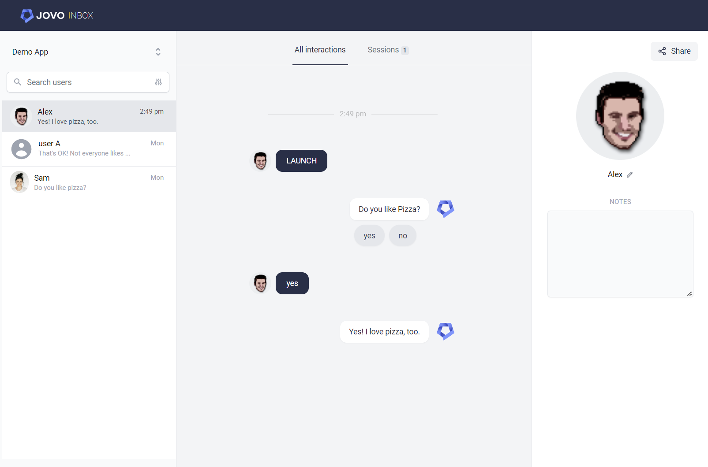

# Jovo Inbox

Access and analyze your [Jovo](https://www.jovo.tech) app conversations using Jovo Inbox.



Jovo Inbox allows you to learn from the conversations your users have with your voice and chat apps, across Alexa, Google's Business Messages, the web, and all other [platforms supported by Jovo](https://www.jovo.tech/marketplace).

This can be used for:

- Monitoring and analyzing live conversations
- Coordinated QA testing with your team and beta testers

Jovo Inbox can be hosted on your own servers. You have full control, no user data is sent to Jovo servers.

Learn more below:

- [Getting Started](#getting-started)
  - [Recommended: Using Docker](#recommended-using-docker)
  - [Alternative: Manual Installation](#alternative-manual-installation)
  - [Connect to Jovo App](#connect-to-jovo-app)
- [Features](#features)
  - [CSV Export](#csv-export)
- [Deployment](#deployment)


## Getting Started

First, download the repository:

```sh
# Clone repository
$ git clone https://github.com/jovotech/jovo-inbox.git
$ cd jovo-inbox
```

Then, copy the `.env.example` file and rename it to `.env`. Right now, you don't need to make any changes to the file:

```t
NODE_ENV=development # or production

MYSQL_HOST=localhost
MYSQL_PORT=3306
MYSQL_USER=jovoinbox
MYSQL_PASSWORD=pass123
MYSQL_DATABASE=jovoinbox
MYSQL_ROOT_PASSWORD=pass123

VUE_APP_BASE_APP_URL=http://localhost:4000 # or https://example.com for production
AVATARS_PATH=../../storage/avatars # or /usr/src/app/storage/avatars/ for production (docker)
```

There are 2 options how you can run Jovo Inbox locally:

- [Recommended: Using Docker](#recommended-using-docker)
- [Alternative: Manual Setup](#alternative-manual-setup)


### Recommended: Using Docker

By using Docker, you don't need to start all the services by yourself. Docker Compose sets up a MySQL database and starts the backend and frontend services.

```sh
# Clone repository
$ git clone https://github.com/jovotech/jovo-inbox.git
$ cd jovo-inbox

# Start Docker container
$ docker-compose -f docker-compose.yml -f docker-compose.development.yml up
```

Then open http://localhost:8080 and create a project.

[Learn how to connect that project to your Jovo app below](#connect-to-jovo-app).


#### Docker Troubleshooting

If you need to rebuild the Docker image, you can also add the `--build` flag:

```sh
# Start Docker container
$ docker-compose -f docker-compose.yml -f docker-compose.development.yml up --build
```

In case of a database error, try deleting the volume `jovo-inbox_mysql_data`:

```sh
$ docker volume rm jovo-inbox_mysql_data
```


### Alternative: Manual Setup

You can also manually start all the services. This is especially helpful for local development because it doesn't require the Docker images to be rebuilt with every change.

Make sure that you have a MySQL database running and have the correct credentials in `.env`.

```sh
# Install dependencies for /core, /backend, /frontend
$ npm run setup

# Start the backend
$ cd backend
$ npm run start:dev

# Start the frontend
$ cd frontend
$ npm run serve
```

Then open http://localhost:8080 and create a project.

[Learn how to connect that project to your Jovo app below](#connect-to-jovo-app).


### Connect to Jovo App

Install the Jovo Inbox plugin as explained here: https://github.com/jovotech/jovo-framework/tree/v4/latest/integrations/plugin-inbox/docs

```typescript
// src/app.prod.ts

import { JovoInbox } from '@jovotech/plugin-inbox';
// ...

app.configure({
  plugins: [
    new JovoInbox({
      projectId: '<PROJECT_ID>',
    }),
    // ...
  ],
});
```

## Features

### CSV Export

Logs can be exported in csv format calling this api url: 

`http://localhost:4000/api/inboxlog/export?projectId=<PROJECT_ID>&from=2023-01-01&to=2023-01-31`

Available query params:
* `projectId`
* `from`: Timestamp `YYYY-MM-DD`
* `to`: Timestamp `YYYY-MM-DD`

Structure of the exported columns:
`userId`, `userSaid`, `botSaid`, `intent`, `timestamp`


## Deployment

### Requirements
* Server with at least 2gb of RAM

This is not the best way, but sufficient for the beginning. Better approaches will follow.

Copy `.env.example`, rename it to `.env.production`.

```sh
$ cd /frontend
$ cp .env.example .env.production
```

Change the `VUE_APP_BACKEND_URL` env variable to `http://<MY_SERVER>:4000/api`.

Build the frontend files into `api/public/client`:

```sh
$ cd /frontend
$ npm run build
```

Run the API:

```shell
$ cd /backend
$ npm start
```

Then open `http://<MY_SERVER>:4000`.


### Run Docker image on Ubuntu

1. Install Docker on Ubuntu: https://docs.docker.com/engine/install/ubuntu/

```shell
$ sudo apt-get update
$ sudo apt-get install \
   ca-certificates \
   curl \
   gnupg \
   lsb-release
$ sudo mkdir -p /etc/apt/keyrings
$ curl -fsSL https://download.docker.com/linux/ubuntu/gpg | sudo gpg --dearmor -o /etc/apt/keyrings/docker.gpg
$  echo \
  "deb [arch=$(dpkg --print-architecture) signed-by=/etc/apt/keyrings/docker.gpg] https://download.docker.com/linux/ubuntu \
  $(lsb_release -cs) stable" | sudo tee /etc/apt/sources.list.d/docker.list > /dev/null
$ sudo apt-get update
$ sudo apt-get install docker-ce docker-ce-cli containerd.io docker-compose-plugin docker-compose
```
2. Clone repository (e.g. /opt)

```shell
$ cd /opt
$ git clone https://github.com/jovotech/jovo-inbox.git
```

3. Change owner of the folder

```shell
$ sudo chown -R $USER:$USER /opt/jovo-inbox
```

4. Create .env file in project folder

```shell
$ cd /opt/jovo-inbox
$ cp .env.example .env
```

5. Edit .env file

```shell
$ nano .env
```

```shell
NODE_ENV=production

MYSQL_HOST=db
MYSQL_PORT=3306
MYSQL_USER=jovoinbox
MYSQL_PASSWORD=pass123
MYSQL_DATABASE=jovoinbox

MYSQL_ROOT_PASSWORD=pass123

VUE_APP_BASE_APP_URL=https://my-domain.com
```

6. Install Letsencrypt

```shell
$ sudo apt install certbot python3-certbot-nginx
```

7. Create certificate for domain

```shell
$ sudo systemctl start nginx
$ sudo certbot --nginx -d inbox.jovo.cloud
$ sudo systemctl stop nginx
```

8. Open nginx config and remove comment from last line `include /etc/nginx/nginx.production.conf;`

```shell
$ nano /opt/jovo-inbox/nginx.conf
```

9. Open `production` config and update server_name and certificates to my-domain.com

```shell
$ nano /opt/jovo-inbox/nginx.production.conf
```

10. 

You have two options to start the docker container: Build it yourself or use the prebuild image from docker hub.


a.) Build docker image and run container

```shell
$ sudo docker-compose -f docker-compose.yml -f docker-compose.production.yml up -d --build
```

b.) Pull docker image and run container
```shell
$ sudo docker-compose -f docker-compose.yml -f docker-compose.production.yml up -d
```
